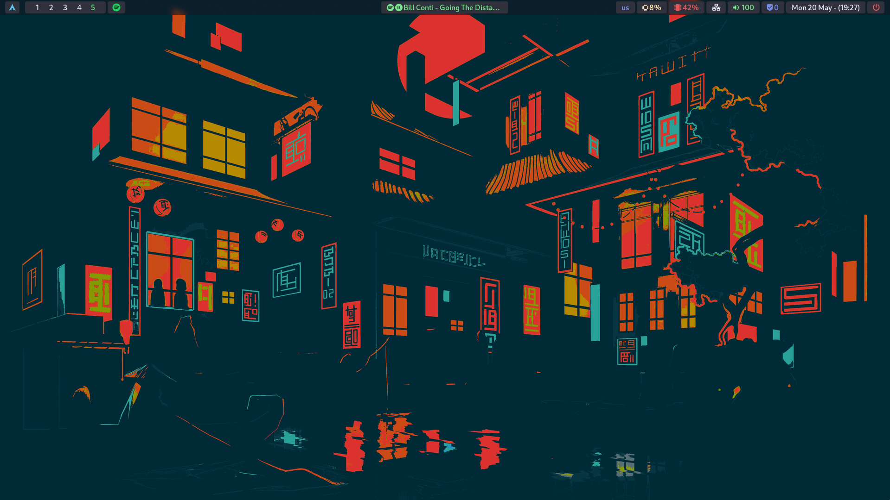

# Hyprland dotfiles

Dependencies:

- Hyprland (Window Manager)
- [Waybar](https://archlinux.org/packages/extra/x86_64/waybar/) (Static bar to your screen)
- [Rofi](https://archlinux.org/packages/extra/x86_64/rofi/) (A window switcher, Application launcher and dmenu replacement.)
- [Dunst](https://archlinux.org/packages/extra/x86_64/dunst/) (Notification daemon)
- [Nemo](https://archlinux.org/packages/?name=nemo) (File Manager)
- [Yazi](https://yazi-rs.github.io/) (Terminal File Manager)
- [Kitty](https://archlinux.org/packages/extra/x86_64/kitty/) (the fast, feature-rich, cross-platform, GPU based terminal)
- [Neovim](https://archlinux.org/packages/extra/x86_64/neovim/)
- [Grimblast](https://archlinux.org/packages/extra/x86_64/neovim/) (Tool to make screenshots on hyprland)
- [wl-clipboard](https://aur.archlinux.org/packages/wl-clipboard-rs) (clipboard, needed to save screenshots in clipboard)
- [Gammastep](https://archlinux.org/packages/extra/x86_64/gammastep/) (Night Shift)

- [rofi-calc](https://archlinux.org/packages/extra/x86_64/rofi-calc/) (Calculator with rofi)
- [python-gobject](https://archlinux.org/packages/extra/x86_64/python-gobject/) (to make spotify module working)

